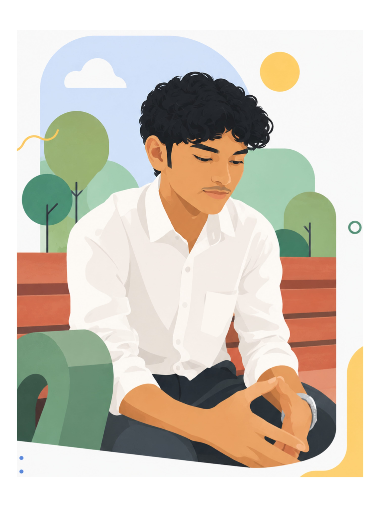

<div align="center">

<!-- TOP WAVE BANNER -->


</div>

<!-- HERO: TWO-COLUMN LAYOUT (portrait + intro) -->
<table width="100%" border="0" cellspacing="0" cellpadding="0">
<tr>
<td width="38%" align="center" valign="middle">

<!-- ILLUSTRATED PORTRAIT — hosted in this repo -->


</td>
<td width="62%" align="left" valign="middle">

<!-- ASCII NAME BLOCK -->
```
███╗   ███╗██╗   ██╗ ██████╗ ███████╗███████╗████████╗██╗  ██╗
████╗ ████║██║   ██║██╔═══██╗██╔════╝██╔════╝╚══██╔══╝██║  ██║
██╔████╔██║██║   ██║██║   ██║█████╗  █████╗     ██║   ███████║
██║╚██╔╝██║██║   ██║██║▄▄ ██║██╔══╝  ██╔══╝     ██║   ██╔══██║
██║ ╚═╝ ██║╚██████╔╝╚██████╔╝███████╗███████╗   ██║   ██║  ██║
╚═╝     ╚═╝ ╚═════╝  ╚══▀▀═╝ ╚══════╝╚══════╝   ╚═╝   ╚═╝  ╚═╝
```

<!-- TYPING ANIMATION -->


<br/>

> *B.Tech CSE · G. Pulla Reddy Engineering College, Kurnool · Class of 2028*
> 
> I design with pencils, build with AI, and ship things that feel alive.

<br/>

[](https://muqeeth47.github.io)
[](https://leetcode.com/u/Shaik_Muqeeth/)
[](https://github.com/Muqeeth47)

</td>
</tr>
</table>

---

## 🌌 GitHub Contribution Graph

<div align="center">

[](https://github.com/Muqeeth47)

</div>

---

## 🧩 LeetCode Progress

<div align="center">

[](https://leetcode.com/u/Shaik_Muqeeth/)

</div>

---

## 🚀 Shipped Projects

| Project | What it does | Links |
|---|---|---|
| **Portfolio** | Interactive sketchbook portfolio — scratch-reveal portrait, draggable stickers, anime.js physics | [Live ↗](https://muqeeth47.github.io) · [Repo ↗](https://github.com/Muqeeth47/Portfolio) |
| **ProjectCase** | Text manipulation lab with easter eggs & experimental transformations | [Live ↗](https://textify.wedevit.in) · [Repo ↗](https://github.com/Muqeeth47/projectcase) |
| **Waqt** | Minimal time-tracking tool built for deep focus | [Repo ↗](https://github.com/Muqeeth47/waqt) |
| **FixIt** | Debugging companion — find the bug, fix the vibe | [Repo ↗](https://github.com/Muqeeth47/fixit) |
| **wedevit.in** | Dev studio & project showcase platform | [Live ↗](https://wedevit.in) |

---

## 🛠️ Tech Stack

<div align="center">

**Languages**


**Frameworks & Runtimes**


**I vibe code with 🎯**


[](https://github.com/Muqeeth47)

</div>

---

<div align="center">


*"Built different. Drawn different."*

</div>
