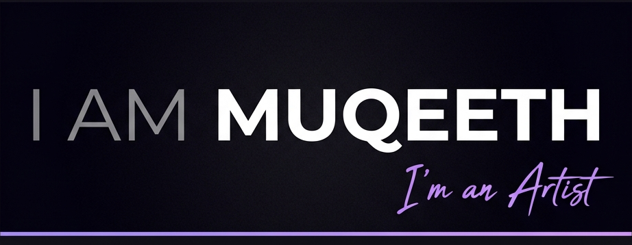
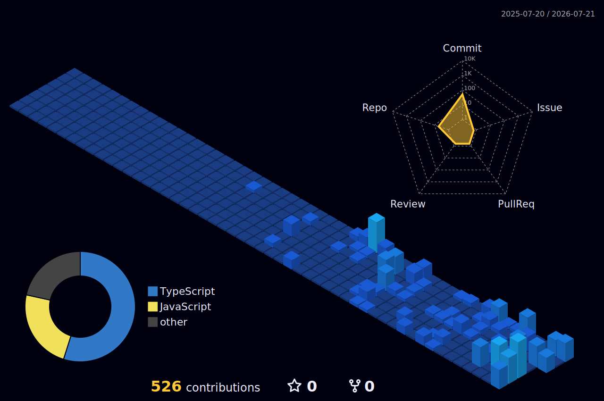

<!-- TOP WAVE — Obsidian + Violet -->

 

<!-- GENERATED HEADER IMAGE — I AM MUQEETH + I'm an Artist -->

 

<!-- SOCIAL BADGES -->

 

> I design with pencils, build with AI, and ship things that feel alive.

---

## GitHub Contribution Graph

---

## LeetCode Progress

<!-- STAT BADGES ROW -->

  

<table border="0" cellspacing="8" cellpadding="0">
<tr>
<td align="center">

</td>
<td align="center">

</td>
</tr>
</table>

---

## Shipped Projects

| Project | What it does | Live |
|---|---|---|
| **Portfolio** | Interactive sketchbook portfolio — scratch-reveal portrait, draggable stickers, anime.js physics | [Live](https://muqeeth.wedevit.in/) |
| **ProjectCase** | Text manipulation lab with easter eggs and experimental transformations | [Live](https://textify.wedevit.in/) |
| **Waqt** | Minimal time-tracking tool built for deep focus | [Live](https://waqt-rho.vercel.app/) |
| **FixIt** | Debugging companion — find the bug, fix the vibe | [Live](https://letsfixindia.com/) |
| **wedevit.in** | Dev studio and project showcase platform | [Live](https://wedevit.in) |

---

## Tech Stack

**Languages**

**Frameworks**

**I vibe code with**

---

*"Built different. Drawn different."*

